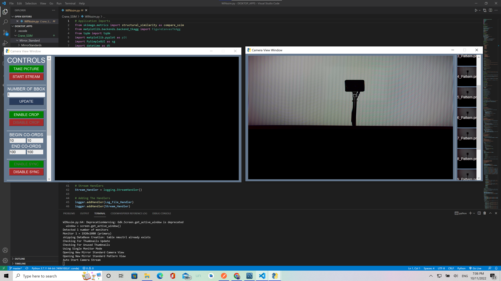

# Crane2
Repository For the development of windows 10 interface that allows the user to input images, which are then processed by an AI regression model. The aim of this project was to determine the quality of the product.

## AIM
- The aim of this project was to determine the quality of the product

## INTERFACE SAMPLES
- Application Home

- Settings Interface

- Operational Interface

